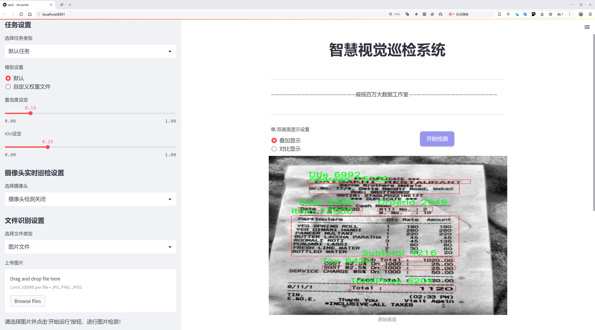
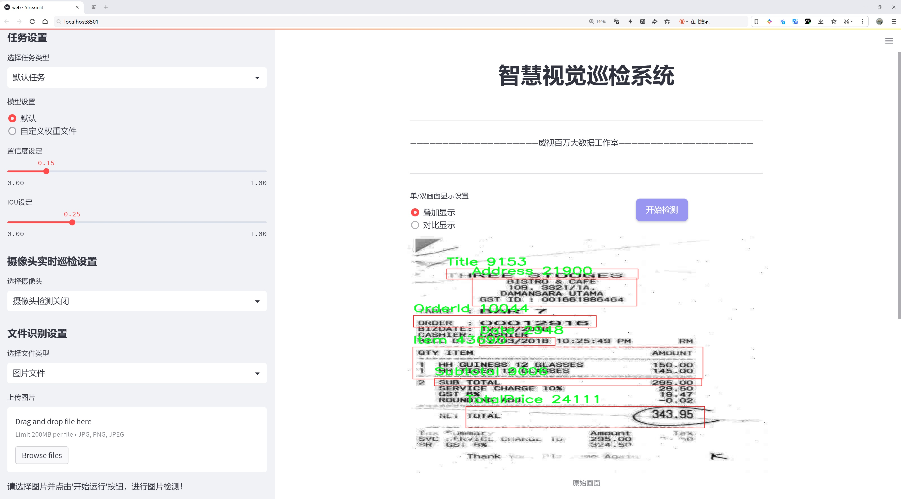
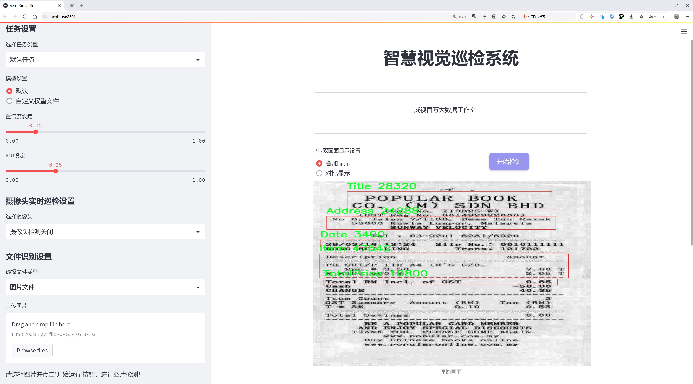
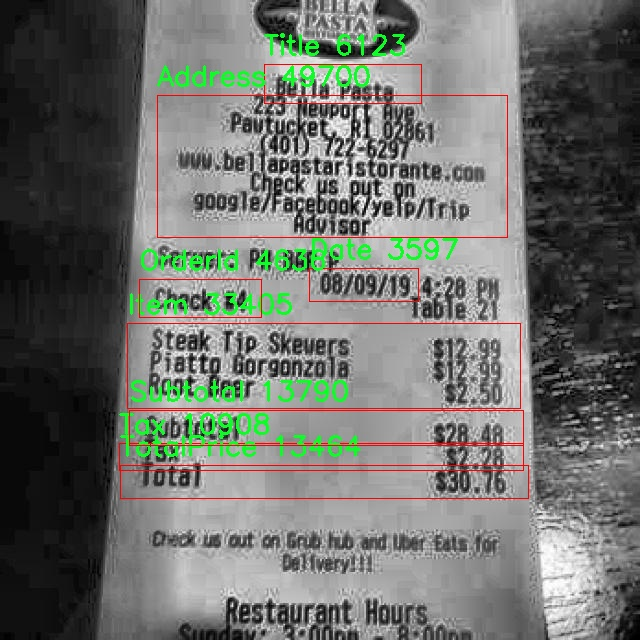
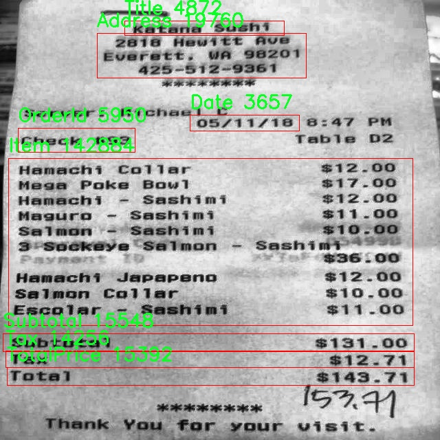
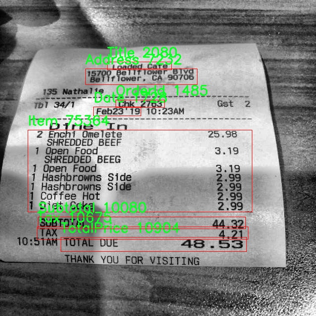
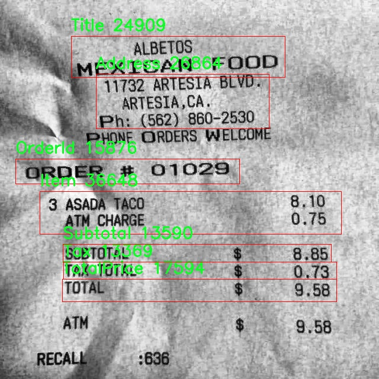
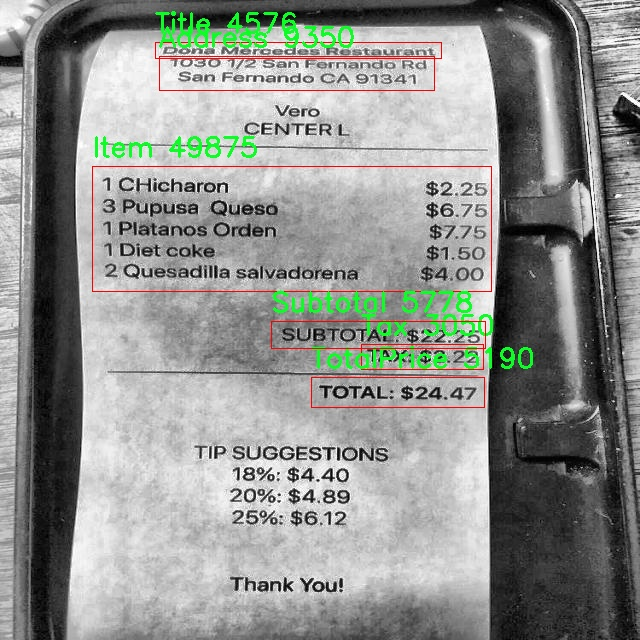

# 收据信息提取检测系统源码分享
 # [一条龙教学YOLOV8标注好的数据集一键训练_70+全套改进创新点发刊_Web前端展示]

### 1.研究背景与意义

项目参考[AAAI Association for the Advancement of Artificial Intelligence](https://gitee.com/qunmasj/projects)

项目来源[AACV Association for the Advancement of Computer Vision](https://kdocs.cn/l/cszuIiCKVNis)

研究背景与意义

随着电子商务和数字支付的迅猛发展，收据作为交易的重要凭证，承载着丰富的商业信息。传统的手动录入和管理收据信息不仅效率低下，而且容易出现人为错误，导致数据的准确性和完整性受到影响。因此，开发一种高效、准确的收据信息提取系统显得尤为重要。近年来，深度学习技术的快速发展为图像识别和信息提取提供了新的解决方案，尤其是基于卷积神经网络（CNN）的目标检测模型在处理复杂视觉任务方面表现出色。

YOLO（You Only Look Once）系列模型作为目标检测领域的佼佼者，以其高效的实时检测能力和较高的准确率受到广泛关注。YOLOv8作为该系列的最新版本，进一步优化了模型结构和算法，提升了检测精度和速度。通过对YOLOv8进行改进，结合收据信息提取的特定需求，可以有效提升收据信息的自动化处理能力。具体而言，改进后的YOLOv8模型能够在复杂背景下准确识别收据中的关键信息，如地址、日期、商品名称、订单号、小计、税额、标题和总价等八个类别。这不仅提高了信息提取的准确性，还能大幅度降低人工干预的需求，进而提升工作效率。

在数据集方面，本研究使用了包含1700张收据图像的模块，涵盖了八个类别的信息。这一数据集的多样性和丰富性为模型的训练和验证提供了坚实的基础。通过对这些图像进行标注和分类，模型能够学习到不同类型收据的特征，从而在实际应用中具备更强的泛化能力。此外，数据集的规模也为模型的优化和调整提供了充足的样本，确保了模型在不同场景下的鲁棒性。

本研究的意义不仅在于技术层面的创新，更在于其广泛的应用前景。通过构建基于改进YOLOv8的收据信息提取系统，可以为企业和个人提供便捷的财务管理工具，自动化处理收据信息，减少人工成本，提升数据处理的效率和准确性。同时，该系统还可以为大数据分析提供支持，帮助企业从海量的收据信息中提取有价值的商业洞察，优化决策过程。此外，随着人工智能技术的不断进步，该系统的应用范围可以扩展到其他文档类型的信息提取，推动智能文档处理技术的发展。

综上所述，基于改进YOLOv8的收据信息提取系统的研究，不仅具有重要的学术价值，也为实际应用提供了切实可行的解决方案。通过深入探索这一领域，可以为推动智能化财务管理、提升商业效率和促进数据驱动决策提供有力支持。

### 2.图片演示







##### 注意：由于此博客编辑较早，上面“2.图片演示”和“3.视频演示”展示的系统图片或者视频可能为老版本，新版本在老版本的基础上升级如下：（实际效果以升级的新版本为准）

  （1）适配了YOLOV8的“目标检测”模型和“实例分割”模型，通过加载相应的权重（.pt）文件即可自适应加载模型。

  （2）支持“图片识别”、“视频识别”、“摄像头实时识别”三种识别模式。

  （3）支持“图片识别”、“视频识别”、“摄像头实时识别”三种识别结果保存导出，解决手动导出（容易卡顿出现爆内存）存在的问题，识别完自动保存结果并导出到tempDir中。

  （4）支持Web前端系统中的标题、背景图等自定义修改，后面提供修改教程。

  另外本项目提供训练的数据集和训练教程,暂不提供权重文件（best.pt）,需要您按照教程进行训练后实现图片演示和Web前端界面演示的效果。

### 3.视频演示

[3.1 视频演示](https://www.bilibili.com/video/BV1fZstePERy/)

### 4.数据集信息展示

##### 4.1 本项目数据集详细数据（类别数＆类别名）

nc: 8
names: ['Address', 'Date', 'Item', 'OrderId', 'Subtotal', 'Tax', 'Title', 'TotalPrice']


##### 4.2 本项目数据集信息介绍

数据集信息展示

在现代商业环境中，收据信息提取系统的需求日益增长，尤其是在电子商务和财务管理领域。为满足这一需求，我们构建了一个专门用于训练改进YOLOv8模型的“Receipts”数据集。该数据集旨在提高收据信息提取的准确性和效率，助力智能化财务处理。

“Receipts”数据集包含了丰富的收据信息，涵盖了多种重要的类别，以便于模型在实际应用中能够准确识别和提取所需信息。该数据集共包含8个类别，分别为：地址（Address）、日期（Date）、商品项（Item）、订单编号（OrderId）、小计（Subtotal）、税额（Tax）、标题（Title）和总价（TotalPrice）。这些类别的设计考虑到了收据的常见结构和用户的实际需求，使得模型能够全面捕捉收据中的关键信息。

在数据集的构建过程中，我们收集了来自不同商家的多种类型的收据样本，确保数据的多样性和代表性。这些收据样本不仅包括传统的纸质收据，还涵盖了电子收据，以反映当前市场的多样化趋势。每个收据样本都经过精心标注，确保每个类别的信息都能够被准确识别。通过这种方式，我们的“Receipts”数据集为YOLOv8模型的训练提供了坚实的基础。

在实际应用中，收据信息提取系统需要处理各种格式和风格的收据，因此，数据集中的样本涵盖了不同的字体、颜色和布局。这种多样性使得模型在训练过程中能够学习到更为丰富的特征，从而在面对未知样本时表现出更强的适应能力。此外，我们还特别关注了数据集的平衡性，确保每个类别的样本数量相对均衡，以避免模型在训练过程中出现偏向某一类别的情况。

为了进一步提升模型的性能，我们在数据集中引入了一些数据增强技术，如旋转、缩放和裁剪等。这些技术不仅增加了数据集的样本数量，还有效提高了模型的鲁棒性，使其能够在各种环境下稳定运行。通过这种方式，我们希望“Receipts”数据集能够为改进YOLOv8模型提供全面的支持，助力其在收据信息提取任务中的表现。

总之，“Receipts”数据集是一个专为收据信息提取而设计的高质量数据集，涵盖了多种类别，具有丰富的样本和多样的特征。它不仅为YOLOv8模型的训练提供了坚实的基础，也为未来的研究和应用奠定了良好的基础。随着技术的不断进步，我们期待该数据集能够在智能财务处理领域发挥更大的作用，推动收据信息提取技术的进一步发展。











### 5.全套项目环境部署视频教程（零基础手把手教学）

[5.1 环境部署教程链接（零基础手把手教学）](https://www.ixigua.com/7404473917358506534?logTag=c807d0cbc21c0ef59de5)


[5.2 安装Python虚拟环境创建和依赖库安装视频教程链接（零基础手把手教学）](https://www.ixigua.com/7404474678003106304?logTag=1f1041108cd1f708b01a)

### 6.手把手YOLOV8训练视频教程（零基础小白有手就能学会）

[6.1 手把手YOLOV8训练视频教程（零基础小白有手就能学会）](https://www.ixigua.com/7404477157818401292?logTag=d31a2dfd1983c9668658)

### 7.70+种全套YOLOV8创新点代码加载调参视频教程（一键加载写好的改进模型的配置文件）

[7.1 70+种全套YOLOV8创新点代码加载调参视频教程（一键加载写好的改进模型的配置文件）](https://www.ixigua.com/7404478314661806627?logTag=29066f8288e3f4eea3a4)

### 8.70+种全套YOLOV8创新点原理讲解（非科班也可以轻松写刊发刊，V10版本正在科研待更新）

由于篇幅限制，每个创新点的具体原理讲解就不一一展开，具体见下列网址中的创新点对应子项目的技术原理博客网址【Blog】：


[8.1 70+种全套YOLOV8创新点原理讲解链接](https://gitee.com/qunmasj/good)

### 9.系统功能展示（检测对象为举例，实际内容以本项目数据集为准）

图9.1.系统支持检测结果表格显示

  图9.2.系统支持置信度和IOU阈值手动调节

  图9.3.系统支持自定义加载权重文件best.pt(需要你通过步骤5中训练获得)

  图9.4.系统支持摄像头实时识别

  图9.5.系统支持图片识别

  图9.6.系统支持视频识别

  图9.7.系统支持识别结果文件自动保存

  图9.8.系统支持Excel导出检测结果数据


### 10.原始YOLOV8算法原理

原始YOLOv8算法原理

YOLOv8算法是由Glenn-Jocher提出的最新一代YOLO（You Only Look Once）系列目标检测模型，标志着YOLO技术的又一次重大飞跃。自2015年首次推出以来，YOLO系列经历了多个版本的迭代，每个版本都在推理速度、检测精度、训练便利性以及硬件兼容性等方面进行了优化。YOLOv8在这些方面的改进，使其成为当前业界最受欢迎和成功的目标检测算法之一。

YOLOv8的网络结构主要由三部分组成：Backbone（骨干网络）、Neck（颈部结构）和Head（头部结构）。其中，Backbone负责特征提取，Neck负责特征融合，而Head则负责最终的检测信息输出。与之前的YOLO版本相比，YOLOv8在Backbone中引入了C2f模块，替代了YOLOv5中的C3模块。C2f模块通过增加更多的分支，增强了梯度回传时的特征流动性，从而提高了特征提取的效率和准确性。

在数据预处理方面，YOLOv8延续了YOLOv5的策略，采用了多种数据增强技术，包括马赛克增强、混合增强、空间扰动和颜色扰动等。这些增强手段不仅丰富了训练数据的多样性，还有效提升了模型的鲁棒性，使其在面对不同场景和条件时能够保持较高的检测性能。

YOLOv8的Neck结构依然采用了FPN（Feature Pyramid Network）和PAN（Path Aggregation Network）的组合，这种结构使得多尺度信息能够得到充分的融合，进而提高了模型对不同尺寸目标的检测能力。通过将特征图在不同层次上进行融合，YOLOv8能够更好地捕捉到目标的上下文信息，从而提升检测的准确性。

在Head结构方面，YOLOv8采用了解耦头（Decoupled Head）设计，这一设计的核心思想是将分类和定位任务分开处理。与传统的耦合头不同，解耦头通过两条并行的分支分别提取类别特征和位置特征，最后通过1×1卷积分别完成分类和定位任务。这种结构不仅提高了模型的灵活性，还使得分类和定位的精度得到了显著提升。

标签分配策略是YOLOv8的一大创新。不同于YOLOv5依赖于候选框聚类的方式，YOLOv8采用了TOOD（Target-Oriented Object Detection）策略，这是一种动态标签分配策略。该策略通过直接使用目标框和目标分数，简化了标签分配的过程。YOLOv8的损失函数主要由类别损失和位置损失两部分组成，其中类别损失采用了VFL（Varifocal Loss），而位置损失则结合了CIoU（Complete Intersection over Union）和DFL（Distribution Focal Loss）两种损失形式。

VFL损失函数的设计考虑了正负样本的不同权重，通过对负样本进行衰减，减少其对损失的贡献，从而使模型能够更加专注于高质量的正样本。这种策略不仅提高了模型对正样本的敏感性，还有效降低了负样本对整体损失的影响，从而提升了模型的检测性能。

YOLOv8还提供了多种模型设置选项，包括depth_factor、width_factor和ratio等参数，这些参数允许用户根据实际需求调整模型的深度、宽度和通道数。通过合理设置这些参数，用户可以在保证检测精度的前提下，优化模型的推理速度和计算资源消耗。

总的来说，YOLOv8在继承YOLO系列优秀特性的基础上，通过引入新的模块和优化策略，进一步提升了目标检测的性能。其高效的特征提取能力、灵活的标签分配策略以及强大的数据增强手段，使得YOLOv8在各种应用场景中都能表现出色。无论是在实时视频监控、自动驾驶、无人机监测，还是在工业检测等领域，YOLOv8都展现出了强大的适应性和广泛的应用潜力，成为了目标检测领域的重要工具。


### 11.项目核心源码讲解（再也不用担心看不懂代码逻辑）

#### 11.1 ui.py

以下是对给定代码的核心部分进行保留和详细注释的版本：

```python
import sys
import subprocess

def run_script(script_path):
    """
    使用当前 Python 环境运行指定的脚本。

    Args:
        script_path (str): 要运行的脚本路径

    Returns:
        None
    """
    # 获取当前 Python 解释器的路径
    python_path = sys.executable

    # 构建运行命令，使用 streamlit 运行指定的脚本
    command = f'"{python_path}" -m streamlit run "{script_path}"'

    # 执行命令并等待其完成
    result = subprocess.run(command, shell=True)
    
    # 检查命令执行结果，如果返回码不为0，则表示出错
    if result.returncode != 0:
        print("脚本运行出错。")

# 主程序入口
if __name__ == "__main__":
    # 指定要运行的脚本路径
    script_path = "web.py"  # 假设脚本在当前目录下

    # 调用函数运行指定的脚本
    run_script(script_path)
```

### 代码分析和注释：

1. **导入模块**：
   - `sys`：用于访问与 Python 解释器紧密相关的变量和函数。
   - `subprocess`：用于创建新进程、连接到它们的输入/输出/错误管道，并获得返回码。

2. **`run_script` 函数**：
   - 该函数接受一个参数 `script_path`，表示要运行的 Python 脚本的路径。
   - 使用 `sys.executable` 获取当前 Python 解释器的路径，以确保使用相同的环境来运行脚本。
   - 构建命令字符串，使用 `streamlit` 模块运行指定的脚本。
   - 使用 `subprocess.run` 执行命令，并通过 `shell=True` 允许在 shell 中执行命令。
   - 检查命令的返回码，如果返回码不为0，表示脚本运行出错，打印错误信息。

3. **主程序入口**：
   - 通过 `if __name__ == "__main__":` 确保只有在直接运行该脚本时才会执行以下代码。
   - 指定要运行的脚本路径为 `web.py`。
   - 调用 `run_script` 函数，传入脚本路径以执行该脚本。

### 重要性：
该代码的核心功能是提供一个简单的接口来运行指定的 Python 脚本，特别是使用 `streamlit` 进行 Web 应用开发时。通过封装在 `run_script` 函数中，代码结构清晰，易于维护和扩展。

这个文件名为 `ui.py`，它的主要功能是通过当前的 Python 环境来运行一个指定的脚本，具体是一个名为 `web.py` 的文件。代码中首先导入了必要的模块，包括 `sys`、`os` 和 `subprocess`，这些模块提供了与系统交互的功能。特别是 `subprocess` 模块，它允许我们在 Python 中执行外部命令。

在 `run_script` 函数中，首先定义了一个参数 `script_path`，用于接收要运行的脚本的路径。函数内部首先获取当前 Python 解释器的路径，这通过 `sys.executable` 实现。接着，构建了一个命令字符串，这个命令使用了 `streamlit` 模块来运行指定的脚本。具体的命令格式是将 Python 解释器与 `-m streamlit run` 结合，再加上脚本的路径。

随后，使用 `subprocess.run` 方法执行这个命令。这个方法会在一个新的 shell 中运行命令，并等待命令执行完成。执行完成后，检查返回的状态码，如果状态码不为 0，表示脚本运行过程中出现了错误，此时会打印出“脚本运行出错”的提示。

在文件的最后部分，使用 `if __name__ == "__main__":` 这一条件判断来确保只有在直接运行该脚本时才会执行下面的代码。这里指定了要运行的脚本路径为 `web.py`，并调用 `run_script` 函数来执行这个脚本。

总的来说，这个 `ui.py` 文件的作用是为一个 Streamlit 应用提供一个启动脚本，通过调用 `web.py` 来启动应用。

#### 11.2 70+种YOLOv8算法改进源码大全和调试加载训练教程（非必要）\ultralytics\models\fastsam\predict.py

以下是代码中最核心的部分，并附上详细的中文注释：

```python
import torch
from ultralytics.engine.results import Results
from ultralytics.models.fastsam.utils import bbox_iou
from ultralytics.models.yolo.detect.predict import DetectionPredictor
from ultralytics.utils import ops

class FastSAMPredictor(DetectionPredictor):
    """
    FastSAMPredictor类专门用于在Ultralytics YOLO框架中进行快速SAM（Segment Anything Model）分割预测任务。
    该类扩展了DetectionPredictor，定制了预测管道，特别针对快速SAM进行了调整。
    """

    def __init__(self, cfg=DEFAULT_CFG, overrides=None, _callbacks=None):
        """
        初始化FastSAMPredictor类，继承自DetectionPredictor，并将任务设置为'分割'。

        Args:
            cfg (dict): 预测的配置参数。
            overrides (dict, optional): 可选的参数覆盖，用于自定义行为。
            _callbacks (dict, optional): 可选的回调函数列表，在预测过程中调用。
        """
        super().__init__(cfg, overrides, _callbacks)
        self.args.task = 'segment'  # 设置任务为分割

    def postprocess(self, preds, img, orig_imgs):
        """
        对预测结果进行后处理，包括非最大抑制和将框缩放到原始图像大小，并返回最终结果。

        Args:
            preds (list): 模型的原始输出预测。
            img (torch.Tensor): 处理后的图像张量。
            orig_imgs (list | torch.Tensor): 原始图像或图像列表。

        Returns:
            (list): 包含处理后的框、掩码和其他元数据的Results对象列表。
        """
        # 应用非最大抑制，过滤掉低置信度的预测
        p = ops.non_max_suppression(
            preds[0],
            self.args.conf,
            self.args.iou,
            agnostic=self.args.agnostic_nms,
            max_det=self.args.max_det,
            nc=1,  # 设置为1类，因为SAM没有类别预测
            classes=self.args.classes)

        # 创建一个全框，用于后续的IOU计算
        full_box = torch.zeros(p[0].shape[1], device=p[0].device)
        full_box[2], full_box[3], full_box[4], full_box[6:] = img.shape[3], img.shape[2], 1.0, 1.0
        full_box = full_box.view(1, -1)

        # 计算IOU并更新full_box
        critical_iou_index = bbox_iou(full_box[0][:4], p[0][:, :4], iou_thres=0.9, image_shape=img.shape[2:])
        if critical_iou_index.numel() != 0:
            full_box[0][4] = p[0][critical_iou_index][:, 4]
            full_box[0][6:] = p[0][critical_iou_index][:, 6:]
            p[0][critical_iou_index] = full_box  # 更新预测框

        # 确保原始图像是一个numpy数组
        if not isinstance(orig_imgs, list):
            orig_imgs = ops.convert_torch2numpy_batch(orig_imgs)

        results = []  # 存储最终结果
        proto = preds[1][-1] if len(preds[1]) == 3 else preds[1]  # 获取掩码原型

        # 遍历每个预测结果
        for i, pred in enumerate(p):
            orig_img = orig_imgs[i]  # 获取原始图像
            img_path = self.batch[0][i]  # 获取图像路径
            if not len(pred):  # 如果没有预测框
                masks = None
            elif self.args.retina_masks:  # 如果使用Retina掩码
                pred[:, :4] = ops.scale_boxes(img.shape[2:], pred[:, :4], orig_img.shape)  # 缩放框
                masks = ops.process_mask_native(proto[i], pred[:, 6:], pred[:, :4], orig_img.shape[:2])  # 处理掩码
            else:  # 否则使用常规掩码处理
                masks = ops.process_mask(proto[i], pred[:, 6:], pred[:, :4], img.shape[2:], upsample=True)  # 处理掩码
                pred[:, :4] = ops.scale_boxes(img.shape[2:], pred[:, :4], orig_img.shape)  # 缩放框
            # 将结果存储到Results对象中
            results.append(Results(orig_img, path=img_path, names=self.model.names, boxes=pred[:, :6], masks=masks))
        return results  # 返回最终结果列表
```

### 代码核心部分说明：
1. **FastSAMPredictor类**：该类继承自`DetectionPredictor`，用于快速分割任务。
2. **初始化方法**：设置任务为分割，并调用父类的初始化方法。
3. **后处理方法**：对模型的原始预测结果进行后处理，包括非最大抑制、IOU计算和掩码处理，最终返回包含处理结果的列表。

该程序文件是Ultralytics YOLO框架中用于快速SAM（Segment Anything Model）分割预测的实现，文件名为`predict.py`。它定义了一个名为`FastSAMPredictor`的类，该类继承自`DetectionPredictor`，并专门针对快速SAM分割任务进行了定制。

在类的构造函数`__init__`中，调用了父类的构造函数，并将任务类型设置为“segment”，表示该预测器主要用于图像分割任务。构造函数接受三个参数：配置参数`cfg`、可选的参数覆盖`overrides`和可选的回调函数列表`_callbacks`。

`postprocess`方法是该类的核心功能之一，负责对模型的原始输出进行后处理。它的输入包括模型的预测结果`preds`、处理后的图像张量`img`以及原始图像或图像列表`orig_imgs`。该方法首先应用非极大值抑制（NMS）来过滤掉重叠的框，确保每个目标只保留一个检测框。由于SAM模型不进行类别预测，因此在NMS中将类别数设置为1。

接下来，方法构建了一个全框（`full_box`），并计算与预测框的IoU（Intersection over Union）值，以确定哪些预测框与全框的重叠度高于0.9。如果有这样的框，则更新全框的相关信息。

然后，方法检查输入的原始图像是否为列表，如果不是，则将其转换为NumPy格式。接着，方法根据预测结果和原始图像的尺寸，处理每个预测框的掩膜，并将处理后的结果封装成`Results`对象，最终返回一个包含所有结果的列表。

总的来说，该文件实现了一个专门用于快速分割任务的预测器，优化了后处理步骤，以适应SAM模型的特点，并提供了对分割掩膜的处理能力。

#### 11.3 code\ultralytics\models\rtdetr\__init__.py

以下是代码中最核心的部分，并附上详细的中文注释：

```python
# 导入RTDETR模型类
from .model import RTDETR

# 导入RTDETR预测器类
from .predict import RTDETRPredictor

# 导入RTDETR验证器类
from .val import RTDETRValidator

# 定义模块的公开接口，指定可以被外部访问的类
__all__ = "RTDETRPredictor", "RTDETRValidator", "RTDETR"
```

### 注释说明：
1. **导入模块**：
   - `from .model import RTDETR`：从当前包中导入`model`模块的`RTDETR`类，这个类通常用于定义YOLO模型的结构和参数。
   - `from .predict import RTDETRPredictor`：从当前包中导入`predict`模块的`RTDETRPredictor`类，该类用于执行模型的预测功能。
   - `from .val import RTDETRValidator`：从当前包中导入`val`模块的`RTDETRValidator`类，这个类用于验证模型的性能和准确性。

2. **定义公开接口**：
   - `__all__`：这是一个特殊变量，用于定义当使用`from module import *`时，哪些类或函数是可以被导入的。在这里，指定了`RTDETRPredictor`、`RTDETRValidator`和`RTDETR`这三个类可以被外部访问。这样做可以控制模块的公开接口，避免不必要的内部实现被暴露。

这个程序文件是一个Python模块的初始化文件，通常用于定义模块的公共接口。在这个特定的文件中，首先有一个注释，表明该模块属于Ultralytics YOLO项目，并且使用AGPL-3.0许可证。

接下来，文件通过相对导入的方式引入了三个组件：`RTDETR`、`RTDETRPredictor`和`RTDETRValidator`。这些组件分别来自于同一目录下的`model`、`predict`和`val`模块。`RTDETR`可能是一个模型类，负责定义和实现某种检测算法；`RTDETRPredictor`可能是一个用于进行预测的类，负责处理输入数据并生成预测结果；而`RTDETRValidator`则可能用于验证模型的性能，评估其在特定数据集上的表现。

最后，`__all__`变量被定义为一个包含字符串的元组，列出了模块的公共接口。这意味着当使用`from module import *`语句时，只会导入`RTDETRPredictor`、`RTDETRValidator`和`RTDETR`这三个组件，而不会导入模块中的其他内容。这种做法有助于控制模块的命名空间，避免不必要的名称冲突，同时也使得模块的使用更加清晰。

#### 11.4 train.py

以下是代码中最核心的部分，并附上详细的中文注释：

```python
class DetectionTrainer(BaseTrainer):
    """
    DetectionTrainer类，继承自BaseTrainer类，用于基于检测模型的训练。
    """

    def build_dataset(self, img_path, mode="train", batch=None):
        """
        构建YOLO数据集。

        参数:
            img_path (str): 包含图像的文件夹路径。
            mode (str): 模式，`train`表示训练模式，`val`表示验证模式，用户可以为每种模式自定义不同的数据增强。
            batch (int, optional): 批次大小，仅在`rect`模式下使用。默认为None。
        """
        gs = max(int(de_parallel(self.model).stride.max() if self.model else 0), 32)
        return build_yolo_dataset(self.args, img_path, batch, self.data, mode=mode, rect=mode == "val", stride=gs)

    def get_dataloader(self, dataset_path, batch_size=16, rank=0, mode="train"):
        """构造并返回数据加载器。"""
        assert mode in ["train", "val"]  # 确保模式为训练或验证
        with torch_distributed_zero_first(rank):  # 在分布式训练中，确保数据集只初始化一次
            dataset = self.build_dataset(dataset_path, mode, batch_size)  # 构建数据集
        shuffle = mode == "train"  # 训练模式下打乱数据
        if getattr(dataset, "rect", False) and shuffle:
            LOGGER.warning("WARNING ⚠️ 'rect=True'与DataLoader的shuffle不兼容，设置shuffle=False")
            shuffle = False
        workers = self.args.workers if mode == "train" else self.args.workers * 2  # 设置工作线程数
        return build_dataloader(dataset, batch_size, workers, shuffle, rank)  # 返回数据加载器

    def preprocess_batch(self, batch):
        """对一批图像进行预处理，包括缩放和转换为浮点数。"""
        batch["img"] = batch["img"].to(self.device, non_blocking=True).float() / 255  # 将图像转移到设备并归一化
        if self.args.multi_scale:  # 如果启用多尺度
            imgs = batch["img"]
            sz = (
                random.randrange(self.args.imgsz * 0.5, self.args.imgsz * 1.5 + self.stride)
                // self.stride
                * self.stride
            )  # 随机选择新的尺寸
            sf = sz / max(imgs.shape[2:])  # 计算缩放因子
            if sf != 1:  # 如果缩放因子不为1
                ns = [
                    math.ceil(x * sf / self.stride) * self.stride for x in imgs.shape[2:]
                ]  # 计算新的形状
                imgs = nn.functional.interpolate(imgs, size=ns, mode="bilinear", align_corners=False)  # 进行插值
            batch["img"] = imgs  # 更新批次图像
        return batch

    def get_model(self, cfg=None, weights=None, verbose=True):
        """返回YOLO检测模型。"""
        model = DetectionModel(cfg, nc=self.data["nc"], verbose=verbose and RANK == -1)  # 创建检测模型
        if weights:
            model.load(weights)  # 加载权重
        return model

    def get_validator(self):
        """返回用于YOLO模型验证的DetectionValidator。"""
        self.loss_names = "box_loss", "cls_loss", "dfl_loss"  # 定义损失名称
        return yolo.detect.DetectionValidator(
            self.test_loader, save_dir=self.save_dir, args=copy(self.args), _callbacks=self.callbacks
        )  # 返回验证器

    def plot_training_samples(self, batch, ni):
        """绘制带有注释的训练样本。"""
        plot_images(
            images=batch["img"],
            batch_idx=batch["batch_idx"],
            cls=batch["cls"].squeeze(-1),
            bboxes=batch["bboxes"],
            paths=batch["im_file"],
            fname=self.save_dir / f"train_batch{ni}.jpg",
            on_plot=self.on_plot,
        )  # 绘制图像

    def plot_metrics(self):
        """从CSV文件中绘制指标。"""
        plot_results(file=self.csv, on_plot=self.on_plot)  # 保存结果图像
```

### 代码核心部分说明：
1. **DetectionTrainer类**：这是一个用于训练YOLO检测模型的类，继承自基础训练类`BaseTrainer`。
2. **build_dataset方法**：构建YOLO数据集，处理图像路径、模式和批次大小。
3. **get_dataloader方法**：创建数据加载器，支持训练和验证模式，处理数据打乱和工作线程数。
4. **preprocess_batch方法**：对输入的图像批次进行预处理，包括归一化和可能的多尺度调整。
5. **get_model方法**：返回一个YOLO检测模型，并可选择性地加载预训练权重。
6. **get_validator方法**：返回一个用于模型验证的对象，包含损失名称。
7. **plot_training_samples和plot_metrics方法**：用于可视化训练样本和训练过程中的指标。

这个程序文件 `train.py` 是一个用于训练 YOLO（You Only Look Once）目标检测模型的脚本，基于 Ultralytics 提供的框架。文件中定义了一个名为 `DetectionTrainer` 的类，该类继承自 `BaseTrainer`，并专门用于处理目标检测任务。

在这个类中，首先定义了一个 `build_dataset` 方法，用于构建 YOLO 数据集。该方法接收图像路径、模式（训练或验证）和批量大小作为参数。它会根据模型的步幅（stride）来确定数据集的构建方式，并调用 `build_yolo_dataset` 函数生成数据集。

接着，`get_dataloader` 方法用于构建数据加载器。它会根据传入的模式（训练或验证）来决定是否打乱数据，并设置工作线程的数量。通过调用 `build_dataloader` 函数，返回一个数据加载器以供后续训练使用。

`preprocess_batch` 方法负责对输入的图像批次进行预处理，包括将图像缩放到适当的大小并转换为浮点数格式。该方法还支持多尺度训练，随机选择图像的大小进行训练，以增强模型的鲁棒性。

`set_model_attributes` 方法用于设置模型的属性，包括类别数量和类别名称等。这些信息会被附加到模型中，以便在训练过程中使用。

`get_model` 方法用于返回一个 YOLO 检测模型的实例。如果提供了权重文件，则会加载这些权重。

`get_validator` 方法返回一个用于验证模型性能的 `DetectionValidator` 实例。它会使用测试数据加载器和保存目录等信息进行初始化。

`label_loss_items` 方法用于返回一个包含训练损失项的字典，方便在训练过程中进行监控和记录。

`progress_string` 方法返回一个格式化的字符串，显示训练进度，包括当前的轮次、GPU 内存使用情况、损失值、实例数量和图像大小等信息。

`plot_training_samples` 方法用于绘制训练样本及其标注，生成的图像会保存到指定的目录中。

最后，`plot_metrics` 和 `plot_training_labels` 方法分别用于绘制训练过程中的指标和创建带标签的训练图，帮助用户可视化训练效果。

整体而言，这个文件提供了一个完整的训练框架，涵盖了数据集构建、数据加载、模型训练、损失监控和结果可视化等多个方面，旨在简化 YOLO 模型的训练过程。

#### 11.5 70+种YOLOv8算法改进源码大全和调试加载训练教程（非必要）\ultralytics\utils\callbacks\raytune.py

以下是经过简化和注释的核心代码部分：

```python
# 导入Ultralytics YOLO库的设置
from ultralytics.utils import SETTINGS

# 尝试导入Ray库并验证Ray Tune集成是否启用
try:
    assert SETTINGS['raytune'] is True  # 确保Ray Tune集成已启用
    import ray
    from ray import tune
    from ray.air import session
except (ImportError, AssertionError):
    tune = None  # 如果导入失败或集成未启用，则将tune设置为None

def on_fit_epoch_end(trainer):
    """在每个训练周期结束时，将训练指标发送到Ray Tune。"""
    if ray.tune.is_session_enabled():  # 检查Ray Tune会话是否启用
        metrics = trainer.metrics  # 获取当前训练指标
        metrics['epoch'] = trainer.epoch  # 添加当前周期数到指标中
        session.report(metrics)  # 向Ray Tune报告指标

# 如果tune可用，则定义回调函数，否则回调为空
callbacks = {
    'on_fit_epoch_end': on_fit_epoch_end, 
} if tune else {}
```

### 代码说明：
1. **导入设置**：从`ultralytics.utils`导入`SETTINGS`，用于获取配置。
2. **Ray库导入**：尝试导入Ray库及其相关模块，并检查Ray Tune集成是否启用。
3. **异常处理**：如果导入失败或集成未启用，`tune`将被设置为`None`，以避免后续代码出错。
4. **回调函数**：定义`on_fit_epoch_end`函数，该函数在每个训练周期结束时被调用，负责将训练指标发送到Ray Tune。
5. **指标报告**：在函数内部，首先检查Ray Tune会话是否启用，如果启用，则获取当前训练指标并将当前周期数添加到指标中，最后将这些指标报告给Ray Tune。
6. **回调字典**：根据`tune`的可用性，构建回调字典`callbacks`，如果`tune`不可用，则回调字典为空。

这个程序文件是一个用于集成Ray Tune的YOLOv8算法改进的回调函数模块。首先，文件引入了`SETTINGS`配置，确保Ray Tune的集成是启用的。如果未能导入Ray库或`SETTINGS`中`raytune`的值不是True，则将`tune`设置为None，表示Ray Tune不可用。

在文件中定义了一个名为`on_fit_epoch_end`的函数，该函数在每个训练周期结束时被调用。其主要功能是将训练过程中的指标（metrics）发送到Ray Tune，以便进行超参数调优和性能监控。具体来说，该函数首先检查Ray Tune的会话是否已启用，如果启用，则从训练器（trainer）中获取当前的指标，并将当前的训练周期（epoch）信息添加到指标中。最后，通过`session.report(metrics)`将这些指标报告给Ray Tune。

最后，文件创建了一个名为`callbacks`的字典，如果`tune`可用，则将`on_fit_epoch_end`函数作为回调函数添加到字典中；如果`tune`不可用，则字典为空。这种设计使得在不同的环境中可以灵活地使用或忽略Ray Tune的功能。整体而言，这段代码为YOLOv8的训练过程提供了与Ray Tune的集成支持，便于进行高效的超参数调优。

#### 11.6 70+种YOLOv8算法改进源码大全和调试加载训练教程（非必要）\ultralytics\models\yolo\classify\train.py

以下是代码中最核心的部分，并附上详细的中文注释：

```python
import torch
from ultralytics.data import ClassificationDataset, build_dataloader
from ultralytics.engine.trainer import BaseTrainer
from ultralytics.models import yolo
from ultralytics.nn.tasks import ClassificationModel, attempt_load_one_weight
from ultralytics.utils import DEFAULT_CFG, LOGGER, RANK
from ultralytics.utils.torch_utils import is_parallel, strip_optimizer, torch_distributed_zero_first

class ClassificationTrainer(BaseTrainer):
    """
    继承自 BaseTrainer 类的分类训练器，用于基于分类模型的训练。
    """

    def __init__(self, cfg=DEFAULT_CFG, overrides=None, _callbacks=None):
        """初始化 ClassificationTrainer 对象，支持配置覆盖和回调函数。"""
        if overrides is None:
            overrides = {}
        overrides['task'] = 'classify'  # 设置任务类型为分类
        if overrides.get('imgsz') is None:
            overrides['imgsz'] = 224  # 默认图像大小为224
        super().__init__(cfg, overrides, _callbacks)

    def set_model_attributes(self):
        """从加载的数据集中设置 YOLO 模型的类名。"""
        self.model.names = self.data['names']

    def get_model(self, cfg=None, weights=None, verbose=True):
        """返回配置好的 PyTorch 模型以用于 YOLO 训练。"""
        model = ClassificationModel(cfg, nc=self.data['nc'], verbose=verbose and RANK == -1)
        if weights:
            model.load(weights)  # 加载权重

        for m in model.modules():
            if not self.args.pretrained and hasattr(m, 'reset_parameters'):
                m.reset_parameters()  # 重置参数
            if isinstance(m, torch.nn.Dropout) and self.args.dropout:
                m.p = self.args.dropout  # 设置 dropout
        for p in model.parameters():
            p.requires_grad = True  # 设置为可训练
        return model

    def build_dataset(self, img_path, mode='train', batch=None):
        """根据图像路径和模式（训练/测试等）创建 ClassificationDataset 实例。"""
        return ClassificationDataset(root=img_path, args=self.args, augment=mode == 'train', prefix=mode)

    def get_dataloader(self, dataset_path, batch_size=16, rank=0, mode='train'):
        """返回带有图像预处理的 PyTorch DataLoader。"""
        with torch_distributed_zero_first(rank):  # 在分布式训练中，确保数据集只初始化一次
            dataset = self.build_dataset(dataset_path, mode)

        loader = build_dataloader(dataset, batch_size, self.args.workers, rank=rank)
        # 附加推理变换
        if mode != 'train':
            if is_parallel(self.model):
                self.model.module.transforms = loader.dataset.torch_transforms
            else:
                self.model.transforms = loader.dataset.torch_transforms
        return loader

    def preprocess_batch(self, batch):
        """预处理一批图像和类别。"""
        batch['img'] = batch['img'].to(self.device)  # 将图像移动到设备上
        batch['cls'] = batch['cls'].to(self.device)  # 将类别移动到设备上
        return batch

    def get_validator(self):
        """返回用于验证的 ClassificationValidator 实例。"""
        self.loss_names = ['loss']  # 定义损失名称
        return yolo.classify.ClassificationValidator(self.test_loader, self.save_dir)

    def final_eval(self):
        """评估训练后的模型并保存验证结果。"""
        for f in self.last, self.best:
            if f.exists():
                strip_optimizer(f)  # 去除优化器信息
                if f is self.best:
                    LOGGER.info(f'\nValidating {f}...')
                    self.metrics = self.validator(model=f)  # 进行验证
                    self.metrics.pop('fitness', None)  # 移除不需要的指标
        LOGGER.info(f"Results saved to {self.save_dir}")

```

### 代码核心部分说明：
1. **类的定义**：`ClassificationTrainer` 类继承自 `BaseTrainer`，用于处理分类任务的训练。
2. **初始化方法**：在初始化时设置任务类型为分类，并设置默认图像大小。
3. **模型设置**：通过 `get_model` 方法创建并配置分类模型，支持加载预训练权重。
4. **数据集和数据加载器**：通过 `build_dataset` 和 `get_dataloader` 方法创建数据集和数据加载器，支持训练和测试模式。
5. **批处理预处理**：`preprocess_batch` 方法将图像和类别移动到指定设备（如 GPU）。
6. **验证器**：`get_validator` 方法返回用于验证的实例。
7. **最终评估**：`final_eval` 方法在训练结束后评估模型并保存结果。

该程序文件是用于训练YOLOv8分类模型的Python脚本，继承自`BaseTrainer`类，提供了一系列方法来配置和训练模型。首先，导入了必要的库和模块，包括PyTorch、Torchvision以及Ultralytics库中的相关组件。

在`ClassificationTrainer`类的构造函数中，初始化了训练器对象，设置了默认的配置和参数。如果没有提供图像大小，默认设置为224。接着，定义了`set_model_attributes`方法，用于从加载的数据集中设置YOLO模型的类名。

`get_model`方法返回一个配置好的PyTorch模型，支持加载预训练权重，并根据需要重置模型参数。`setup_model`方法负责加载模型，可以从本地文件、Torchvision模型或Ultralytics资产中获取。如果模型名称不正确，则会抛出文件未找到的错误。

`build_dataset`方法创建一个分类数据集实例，`get_dataloader`方法返回一个PyTorch数据加载器，处理图像预处理和数据增强。`preprocess_batch`方法将图像和类标签移动到指定的设备上。

`progress_string`方法返回一个格式化的字符串，显示训练进度。`get_validator`方法返回一个验证器实例，用于模型验证。`label_loss_items`方法生成带标签的损失字典，尽管对于分类任务并不需要，但在其他任务中是必要的。

`plot_metrics`方法从CSV文件中绘制指标，`final_eval`方法评估训练后的模型并保存验证结果。最后，`plot_training_samples`方法用于绘制带有注释的训练样本图像。

整体来看，该脚本提供了一个完整的框架，用于训练YOLOv8分类模型，涵盖了模型的设置、数据处理、训练过程监控以及结果评估等多个方面。

### 12.系统整体结构（节选）

### 整体功能和构架概括

该程序是一个基于YOLOv8框架的目标检测和分类模型训练工具，包含多个模块和文件，旨在提供一个灵活且高效的训练、验证和推理环境。整体架构包括模型定义、数据处理、训练过程、结果评估以及可视化等多个方面。主要功能包括：

1. **模型训练**：支持YOLOv8目标检测和分类模型的训练，提供了多种配置选项。
2. **数据处理**：包括数据集的构建、数据加载和预处理，支持多种数据增强技术。
3. **推理和预测**：提供模型推理功能，支持快速分割和目标检测。
4. **性能监控**：集成了回调函数，支持超参数调优和训练过程中的性能监控。
5. **可视化**：提供了可视化工具，用于绘制训练过程中的指标和样本。

### 文件功能整理表

| 文件路径                                                                                                      | 功能描述                                                                                     |
|---------------------------------------------------------------------------------------------------------------|----------------------------------------------------------------------------------------------|
| `D:\tools\20240809\code\ui.py`                                                                                | 启动Streamlit应用，运行指定的`web.py`脚本。                                                |
| `D:\tools\20240809\code\70+种YOLOv8算法改进源码大全和调试加载训练教程（非必要）\ultralytics\models\fastsam\predict.py` | 实现快速SAM分割预测，处理模型输出并生成分割掩膜。                                         |
| `D:\tools\20240809\code\code\ultralytics\models\rtdetr\__init__.py`                                         | 初始化RTDETR模块，导入模型、预测器和验证器，定义公共接口。                                  |
| `D:\tools\20240809\code\train.py`                                                                             | 提供YOLO目标检测模型的训练框架，处理数据集构建、数据加载和训练过程监控。                  |
| `D:\tools\20240809\code\70+种YOLOv8算法改进源码大全和调试加载训练教程（非必要）\ultralytics\utils\callbacks\raytune.py` | 集成Ray Tune，提供训练过程中的指标报告以支持超参数调优。                                   |
| `D:\tools\20240809\code\70+种YOLOv8算法改进源码大全和调试加载训练教程（非必要）\ultralytics\models\yolo\classify\train.py` | 训练YOLOv8分类模型，处理数据集、模型设置和训练过程。                                      |
| `D:\tools\20240809\code\70+种YOLOv8算法改进源码大全和调试加载训练教程（非必要）\ultralytics\utils\callbacks\comet.py` | 集成Comet.ml，用于监控和记录训练过程中的指标和参数。                                      |
| `D:\tools\20240809\code\code\ultralytics\hub\__init__.py`                                                  | 初始化Hub模块，提供模型的加载和管理功能。                                                  |
| `D:\tools\20240809\code\70+种YOLOv8算法改进源码大全和调试加载训练教程（非必要）\ultralytics\nn\extra_modules\dynamic_snake_conv.py` | 实现动态蛇形卷积模块，可能用于改进模型的卷积操作。                                         |
| `D:\tools\20240809\code\70+种YOLOv8算法改进源码大全和调试加载训练教程（非必要）\ultralytics\nn\modules\transformer.py` | 定义Transformer模块，可能用于模型的特征提取和处理。                                       |
| `D:\tools\20240809\code\70+种YOLOv8算法改进源码大全和调试加载训练教程（非必要）\ultralytics\models\nas\model.py` | 实现神经架构搜索（NAS）模型，优化模型结构和性能。                                          |
| `D:\tools\20240809\code\code\ultralytics\nn\modules\block.py`                                               | 定义网络块，提供构建YOLO模型的基本组件。                                                  |
| `D:\tools\20240809\code\ultralytics\models\fastsam\predict.py`                                              | （重复）实现快速SAM分割预测，处理模型输出并生成分割掩膜。                                 |

这个表格总结了每个文件的主要功能，帮助理解整个项目的结构和各个模块的作用。

注意：由于此博客编辑较早，上面“11.项目核心源码讲解（再也不用担心看不懂代码逻辑）”中部分代码可能会优化升级，仅供参考学习，完整“训练源码”、“Web前端界面”和“70+种创新点源码”以“13.完整训练+Web前端界面+70+种创新点源码、数据集获取”的内容为准。

### 13.完整训练+Web前端界面+70+种创新点源码、数据集获取


# [下载链接：https://mbd.pub/o/bread/ZpuZk5dw](https://mbd.pub/o/bread/ZpuZk5dw)